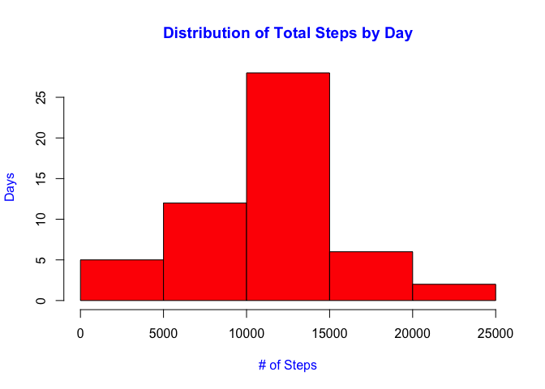
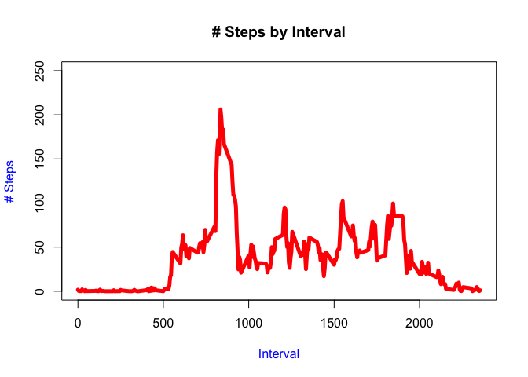
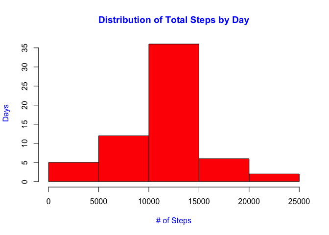
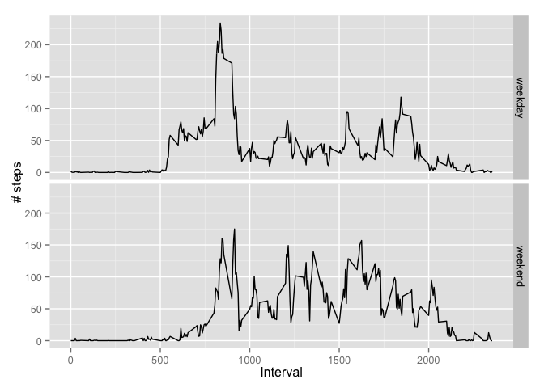

# Reproducible Research: Peer Assessment 1


# Introduction

It is now possible to collect a large amount of data about personal movement using activity monitoring devices such as a Fitbit, Nike Fuelband, or Jawbone Up. These type of devices are part of the “quantified self” movement – a group of enthusiasts who take measurements about themselves regularly to improve their health, to find patterns in their behavior, or because they are tech geeks. But these data remain under-utilized both because the raw data are hard to obtain and there is a lack of statistical methods and software for processing and interpreting the data.

This assignment makes use of data from a personal activity monitoring device. This device collects data at 5 minute intervals through out the day. The data consists of two months of data from an anonymous individual collected during the months of October and November, 2012 and include the number of steps taken in 5 minute intervals each day.

# Data

#### Dataset: Activity monitoring data [52K]  
- Data Downloaded from [*here*](https://d396qusza40orc.cloudfront.net/repdata%2Fdata%2Factivity.zip) on *May5th 2015*  

#### The variables included in this dataset are:

- steps: Number of steps taking in a 5-minute interval (missing values are coded as NA)

- date: The date on which the measurement was taken in YYYY-MM-DD format

- interval: Identifier for the 5-minute interval in which measurement was taken  

The dataset is stored in a comma-separated-value (CSV) file and there are a total of 17,568 observations in this dataset.

## Loading and preprocessing the data


```r
library(plyr)
library(gam)
```

```
## Loading required package: splines
## Loaded gam 1.09.1
```

```r
library(ggplot2)

# Unzip and read interval level activity data from the current directory
unzip(zipfile = "activity.zip")
ActData <- read.csv("./activity.csv", sep = ","  , header = TRUE)
```

## What is mean total number of steps taken per day?

```r
# Filter NA values 
FilterActData<- ActData[ which(ActData$steps!='NA' ),]


# Aggregate steps data by date
AggData <- ddply(FilterActData, .(date), summarise, totsteps = sum(steps))
```

**Here is the aggregates steps data by date.**

```r
# Display total steps by day
print(AggData[,1:2],right = TRUE, row.names = FALSE)
```

```
##        date totsteps
##  2012-10-02      126
##  2012-10-03    11352
##  2012-10-04    12116
##  2012-10-05    13294
##  2012-10-06    15420
##  2012-10-07    11015
##  2012-10-09    12811
##  2012-10-10     9900
##  2012-10-11    10304
##  2012-10-12    17382
##  2012-10-13    12426
##  2012-10-14    15098
##  2012-10-15    10139
##  2012-10-16    15084
##  2012-10-17    13452
##  2012-10-18    10056
##  2012-10-19    11829
##  2012-10-20    10395
##  2012-10-21     8821
##  2012-10-22    13460
##  2012-10-23     8918
##  2012-10-24     8355
##  2012-10-25     2492
##  2012-10-26     6778
##  2012-10-27    10119
##  2012-10-28    11458
##  2012-10-29     5018
##  2012-10-30     9819
##  2012-10-31    15414
##  2012-11-02    10600
##  2012-11-03    10571
##  2012-11-05    10439
##  2012-11-06     8334
##  2012-11-07    12883
##  2012-11-08     3219
##  2012-11-11    12608
##  2012-11-12    10765
##  2012-11-13     7336
##  2012-11-15       41
##  2012-11-16     5441
##  2012-11-17    14339
##  2012-11-18    15110
##  2012-11-19     8841
##  2012-11-20     4472
##  2012-11-21    12787
##  2012-11-22    20427
##  2012-11-23    21194
##  2012-11-24    14478
##  2012-11-25    11834
##  2012-11-26    11162
##  2012-11-27    13646
##  2012-11-28    10183
##  2012-11-29     7047
```

**Histogram of total steps by the day.**

```r
## Plot a histogram of total steps by day
hist(AggData$totsteps, main="Distribution of Total Steps by Day", col="Red",
     ylab="Days", xlab="# of Steps", col.lab="blue", col.main="blue")
```

 

**Calculate mean and median based on filtered activity data**

```r
# calculate mean and median
meanSteps <- mean(AggData$totsteps, na.rm = TRUE)
meanSteps <- round(meanSteps, digits = 2)
print(c("Old Mean: ", meanSteps),right = TRUE, row.names = FALSE)
```

```
## [1] "Old Mean: "   "10766.19"
```

```r
medianSteps <- median(AggData$totsteps, na.rm = TRUE)
medianSteps <- round(medianSteps, digits = 2)
print(c("Old Median Steps: ",medianSteps),right = TRUE, row.names = FALSE)
```

```
## [1] "Old Median Steps: "              "10765"
```


## What is the average daily activity pattern?

**Interval level activity data across all days** shows a big spike between 5am and 9am.


```r
# Aggregate steps data by interval
AggIntData <- ddply(FilterActData, .(interval), summarise, totsteps = mean(steps))

# Plot the aggregate emissions data and format
plot(AggIntData$totsteps~AggIntData$interval,type="l", ylab="# Steps", xlab="Interval", col.lab="blue", main="# Steps by Interval", col = "red", ylim=c(0, 250), xlim=c(0, 2355), lwd=5)
```

 

Maximum average steps were in 0835 interval (max = 206.16)

```r
max(AggIntData$totsteps)
```

```
## [1] 206.1698
```


## Imputing missing values

```r
# Fill missing vlues using gam package (uses mean to fill in the null values)
FilledActData <- na.gam.replace (ActData)
```

Aggregate and Plot interval data based on filled dataset

```r
# Aggregate steps data by date
AggData <- ddply(FilledActData, .(date), summarise, totsteps = sum(steps))
# Display total steps by day
print(AggData[,1:2],right = TRUE, row.names = FALSE)
```

```
##        date totsteps
##  2012-10-01 10766.19
##  2012-10-02   126.00
##  2012-10-03 11352.00
##  2012-10-04 12116.00
##  2012-10-05 13294.00
##  2012-10-06 15420.00
##  2012-10-07 11015.00
##  2012-10-08 10766.19
##  2012-10-09 12811.00
##  2012-10-10  9900.00
##  2012-10-11 10304.00
##  2012-10-12 17382.00
##  2012-10-13 12426.00
##  2012-10-14 15098.00
##  2012-10-15 10139.00
##  2012-10-16 15084.00
##  2012-10-17 13452.00
##  2012-10-18 10056.00
##  2012-10-19 11829.00
##  2012-10-20 10395.00
##  2012-10-21  8821.00
##  2012-10-22 13460.00
##  2012-10-23  8918.00
##  2012-10-24  8355.00
##  2012-10-25  2492.00
##  2012-10-26  6778.00
##  2012-10-27 10119.00
##  2012-10-28 11458.00
##  2012-10-29  5018.00
##  2012-10-30  9819.00
##  2012-10-31 15414.00
##  2012-11-01 10766.19
##  2012-11-02 10600.00
##  2012-11-03 10571.00
##  2012-11-04 10766.19
##  2012-11-05 10439.00
##  2012-11-06  8334.00
##  2012-11-07 12883.00
##  2012-11-08  3219.00
##  2012-11-09 10766.19
##  2012-11-10 10766.19
##  2012-11-11 12608.00
##  2012-11-12 10765.00
##  2012-11-13  7336.00
##  2012-11-14 10766.19
##  2012-11-15    41.00
##  2012-11-16  5441.00
##  2012-11-17 14339.00
##  2012-11-18 15110.00
##  2012-11-19  8841.00
##  2012-11-20  4472.00
##  2012-11-21 12787.00
##  2012-11-22 20427.00
##  2012-11-23 21194.00
##  2012-11-24 14478.00
##  2012-11-25 11834.00
##  2012-11-26 11162.00
##  2012-11-27 13646.00
##  2012-11-28 10183.00
##  2012-11-29  7047.00
##  2012-11-30 10766.19
```

```r
## Plot a histogram of total steps by day
hist(AggData$totsteps, main="Distribution of Total Steps by Day", col="Red",col.main="blue", col.lab="blue",
     ylab="Days", xlab="# of Steps")
```

 

Calculate mean and median based on filled (NAs replaced by mean values) version of datasets


```r
# calculate mean and median
newMeanSteps <- mean(AggData$totsteps, na.rm = TRUE)
newMeanSteps <- round(newMeanSteps, digits = 2)
print(c("New Mean: ", newMeanSteps),right = TRUE, row.names = FALSE)
```

```
## [1] "New Mean: "   "10766.19"
```

```r
newMedianSteps <- median(AggData$totsteps, na.rm = TRUE)
newMedianSteps <- round(newMedianSteps, digits = 2)
print(c("New Median Steps: ",newMedianSteps),right = TRUE, row.names = FALSE)
```

```
## [1] "New Median Steps: "           "10766.19"
```

There **is a difference** in median after the missing values were added.

```r
newMedianSteps - medianSteps
```

```
## [1] 1.19
```

There was **no change in the mean** values as overall mean was used to fill the missing values.

```r
newMeanSteps - meanSteps
```

```
## [1] 0
```

## Are there differences in activity patterns between weekdays and weekends?

  **Create and assign weekday or weekend based on date using weekdays() function**  


```r
# Create and assign weekday or weekend based on date using weekdays() function
FilterActData$day <- weekdays(as.Date(FilterActData$date))
categorize_day <- function(day) 
         {     day <- 
                 if (day %in% c("Monday", "Tuesday", "Wednesday", "Thursday", "Friday"))    
                   return("weekday") 
                 else if (day %in% c("Saturday", "Sunday"))        
                     return("weekend") 
                 else stop("Error in date conversion") 
}
FilterActData$dayType <- sapply(FilterActData$day, FUN = categorize_day)
```


  **Plot interval level data based on Weekday or weekend average steps**  

```r
# Aggregate steps data by interval and day type (weekend or weekday)
AggCatIntData <- ddply(FilterActData, .(interval,dayType), summarise, totsteps = mean(steps))

# Plot interval level data by interval and day type
ggplot(AggCatIntData, aes(interval, totsteps)) + geom_line() + facet_grid(dayType ~ .) +     
  xlab("Interval") + ylab("# steps")
```

 
  **Weekend activity data spikes slightly later (folks getting up later than weekdays) in the day and is more evenly spreadout that weekday data. This is probably due to standard weekday work/school hours for most people and most activity happens in the morning.** 
